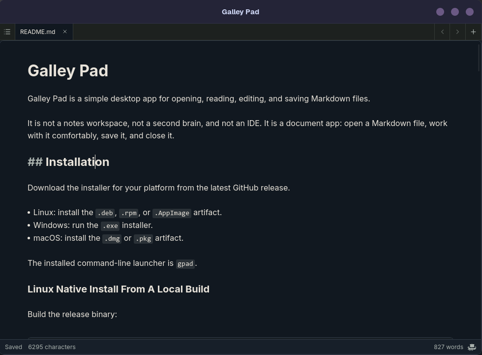

# Galley Pad

[](https://github.com/InkyQuill/galley-pad/releases)
[](https://github.com/InkyQuill/galley-pad/actions/workflows/semantic-release.yml)
[](https://github.com/InkyQuill/galley-pad/actions/workflows/build-release.yml)


Galley Pad is a desktop Markdown editor for people who want to work with plain `.md` files directly.

It is not a notes workspace, not a second brain, and not an IDE. It is a document app: open a Markdown file, edit it comfortably, save it, and close it.



## What It Does

- Opens `.md` and `.markdown` files from the file manager, desktop launcher, or command line.
- Provides a focused Markdown editing surface powered by Galley Editor.
- Saves normal files on disk instead of hiding content in a workspace database.
- Handles multiple files by opening separate document windows.
- Supports creating a new file by opening a path that does not exist yet.
- Provides native desktop packaging for Linux, Windows, and macOS.

## Install

Download the installer for your platform from the latest GitHub release.

- Linux: install the `.deb`, `.rpm`, or `.AppImage` artifact.
- Windows: run the `.exe` installer.
- macOS: install the `.dmg` or `.pkg` artifact.

The installed command-line launcher is `gpad`.

## Usage

Open an existing Markdown file:

```bash
gpad notes.md
```

Open multiple files:

```bash
gpad one.md two.markdown
```

Create a new file by opening a path that does not exist yet:

```bash
gpad new-draft.md
```

Relative paths are resolved from the directory where `gpad` is run. Absolute paths stay absolute. The file is created on disk when it is saved.

## Local Development

Install and activate project toolchains:

```bash
mise install
```

Install dependencies:

```bash
bun install
```

Run the desktop app in development:

```bash
bun run tauri:dev
```

Run the main checks:

```bash
bun run test:unit
bun run test:scripts
cargo test --manifest-path src-tauri/Cargo.toml
bun run build
```

Run the full verification suite:

```bash
mise run verify
```

Build release installers locally:

```bash
bun run tauri -- build
```

On Linux, Tauri produces `.deb`, `.rpm`, and `.AppImage` artifacts when the platform bundling tools are available. On macOS, `bun run macos:pkg -- --release` builds the `.pkg` installer after the `.app` bundle is built.

## Linux Native Install From A Local Build

Build Linux packages:

```bash
bun run tauri -- build --bundles deb,rpm
```

Install the generated package for your distribution from `src-tauri/target/release/bundle/`.

For a user-local install without a distro package, copy the release binary and desktop metadata into the XDG user prefix:

```bash
install -Dm755 src-tauri/target/release/gpad ~/.local/bin/gpad
install -Dm644 src-tauri/icons/icon.png ~/.local/share/icons/hicolor/512x512/apps/gpad.png
```

Create a desktop entry at `~/.local/share/applications/net.inkyquill.GalleyPad.desktop`:

```ini
[Desktop Entry]
Type=Application
Name=Galley Pad
Comment=A simple desktop Markdown editor powered by Galley.
Exec=/home/inky/.local/bin/gpad %F
Icon=gpad
Terminal=false
StartupWMClass=gpad
Categories=Utility;TextEditor;
MimeType=text/markdown;text/x-markdown;
Keywords=markdown;editor;text;
```

Then refresh desktop metadata:

```bash
update-desktop-database ~/.local/share/applications
gtk-update-icon-cache -q -t -f ~/.local/share/icons/hicolor
xdg-mime default net.inkyquill.GalleyPad.desktop text/markdown
xdg-mime default net.inkyquill.GalleyPad.desktop text/x-markdown
```

## Stack

- Tauri for the desktop shell and native file integration
- React for app UI and document state
- Galley Editor for Markdown editing and inline preview
- Rust for filesystem, window lifecycle, dialogs, and platform integration

## Documentation

- [Vision](docs/vision.md)
- [Product principles](docs/product-principles.md)
- [Architecture](docs/architecture.md)
- [Roadmap](docs/roadmap.md)
- [Stage plans](docs/plans/)
- [Galley Editor integration notes](docs/reference/galley-editor.md)

## Releases

Releases are automated with GitHub Actions and semantic-release.

Merging Conventional Commits into `main` runs `.github/workflows/semantic-release.yml`, which:

- analyzes commit messages
- bumps the app version
- updates `CHANGELOG.md`
- writes the release version into package, Cargo, and Tauri metadata
- creates a GitHub release tagged as `vX.Y.Z`
- starts installer builds for Linux, Windows, and macOS

Run a local release dry run:

```bash
bun run release:dry-run
```

The dry run needs a valid `GITHUB_TOKEN` or `GH_TOKEN` with access to this repository.
